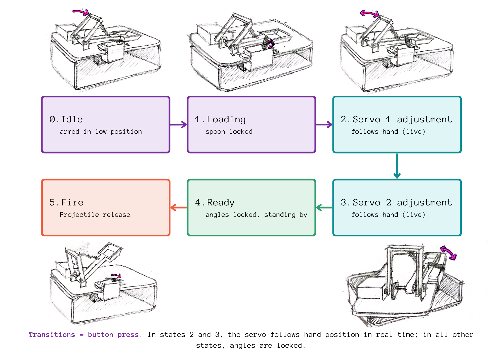
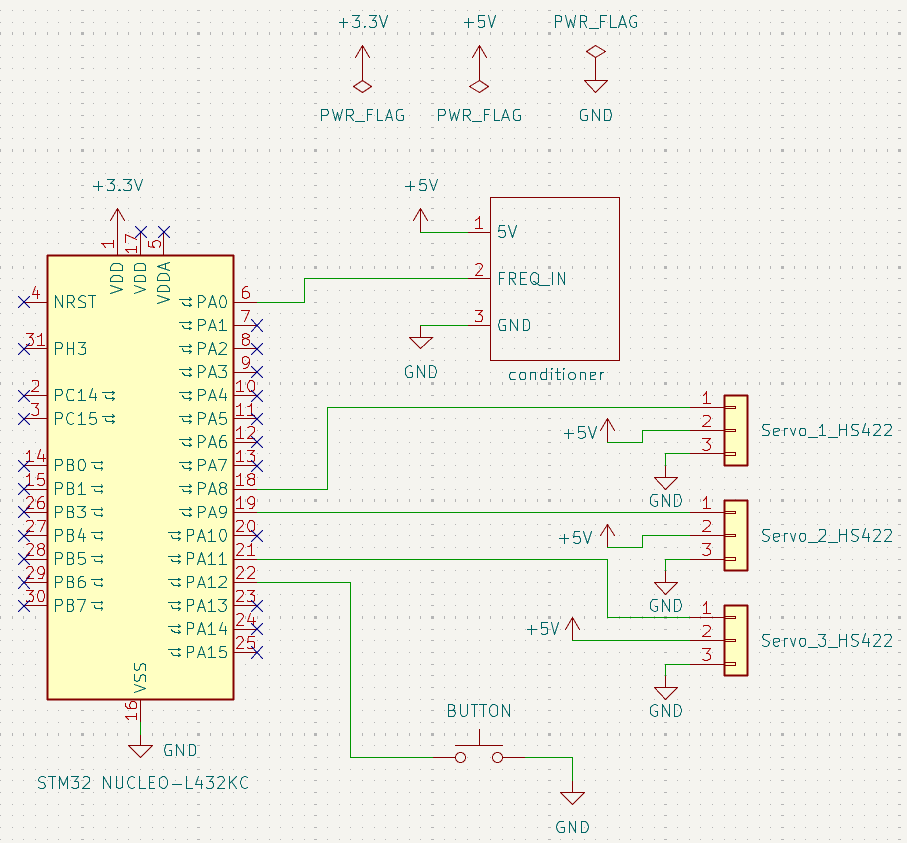
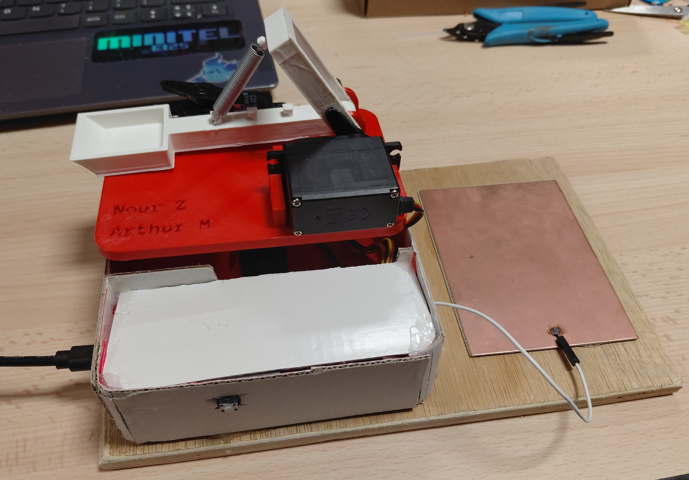

# stm32_capacitive_catapult

A catapult whose firing angle and power are controlled remotely by hand proximity, without any physical contact. The system uses a capacitive copper plate electrode to detect hand distance and translates it into real-time servo motor commands via an STM32 microcontroller.

> **Academic project** — Prototyping module, Mines Saint-Étienne (ISMIN), 2025–2026  

---

## How it works

A copper plate electrode forms a capacitor with the user's hand. As the hand moves closer, the total capacitance increases, which causes the frequency of a signal conditioner circuit to decrease (following F = 1 / (2 × R6 × Ctot)). The STM32 measures this frequency using a timer in **input capture mode**, applies a **10-point moving average filter** to smooth noise, then maps the filtered frequency to a servo angle via a linear law. Three servo motors control the catapult's firing angle, trajectory shape, and spoon locking mechanism.

```
Hand proximity → Capacitance variation → Signal conditioner (freq output) → STM32 input capture (TIM2)
→ Moving average filter → Frequency-to-angle mapping → PWM output (TIM1) → 3x Servo motors
```

---

## My contribution

- Full STM32 firmware (STM32CubeIDE, HAL): frequency measurement, filtering, state machine, PWM generation
- Timer configuration: TIM2 in input capture for frequency measurement, TIM1 for 3-channel PWM servo control
- 10-point moving average filter to stabilize noisy capacitive readings
- 6-state finite state machine controlling the full firing sequence
- KiCad system-level schematic (MCU + conditioner + servos + button)
- 3D mechanical design of the catapult structure
- Experimental calibration of sensor frequency range (29–62 kHz) and servo PWM limits (CCR 150–900)

> Signal conditioner circuit (schematic + PCB) provided by the school (Mines Saint-Étienne). I studied its operating principle and implemented the full STM32 integration and system logic.

---

## Hardware

| Component | Role |
|---|---|
| STM32 Nucleo L432KC | Microcontroller (32 MHz) |
| Copper plate electrode | Capacitive proximity sensor |
| Signal conditioner | Converts capacitance to variable-frequency square wave |
| Servo 1 (HS422) | Controls firing angle (trajectory shape) - range: 40°–125° |
| Servo 2 (HS422) | Controls horizontal orientation - range: 0°–180° |
| Servo 3 (HS422) | Locks / releases the spoon mechanism |
| Push button | Triggers state transitions |

**Sensor frequency range:** 29 kHz (hand close) → 62 kHz (hand far)  
**PWM period:** 20 ms (50 Hz) | CCR range: 150 (0°) → 900 (180°)

---

## State Machine

All transitions are triggered exclusively by button press, ensuring no accidental firing.



| State | Name           | Description |
|---|---|---|
| 0 | Idle               | Armed in high position, spoon released           |
| 1 | Loading            | Spoon locked by servo 3                          |
| 2 | Servo 1 adjustment | Firing angle follows hand in real time           |
| 3 | Servo 2 adjustment | Horizontal orientation follows hand in real time |
| 4 | Ready              | All angles locked, waiting for fire command      |
| 5 | Fire               | Servo 3 releases spoon → projectile launched     |

> In states 2 and 3, servo angles track hand position continuously. In all other states, angles are locked to their last set value.

---

## Firmware Architecture

```
main.c
├── HAL_TIM_IC_CaptureCallback()   ← ISR: measures period between rising edges (TIM2 CH1)
├── moving_average1()              ← 10-point sliding window filter
├── freq_to_angle()                ← Linear mapping [FREQ_MIN, FREQ_MAX] → [0°, 180°]
├── servo_angle_to_ccr()           ← Angle → PWM compare register value
└── main loop
    ├── Button polling + debounce (200 ms)
    ├── State machine transitions
    └── Per-servo angle selection based on current state → PWM update
```

Key implementation details:
- `diff1` (ISR-shared variable) is read with IRQ disabled to ensure atomic access
- Frequency is clamped to [FREQ_MIN, FREQ_MAX] before angle conversion to prevent out-of-range servo commands
- Servo 1 mechanical limits (40°–125°) enforced separately from servo 2 (0°–180°)

---

## System Schematic



---

## Demo

| | |
|---|---|
|  | See [`media/`](media/) for demo video |

---

## Repository Structure

```
stm32-catapult/
├── Core/                        # STM32 firmware source (CubeIDE/HAL)
├── Drivers/                     # HAL + CMSIS libraries
├── schematics/                  # KiCad system schematic + PNG export
├── docs/
│   ├── state_machine_diagram.png
│   ├── schematic.png            # Schematic png
├── media/                       # Photos and demo video
├── cad/                         # 3D mechanical design files
├── stm32_catapult.ioc           # CubeMX configuration
├── STM32L432KCUX_FLASH.ld       # Linker script
└── README.md
```

---

## Known Limitations

- The frequency-to-distance relationship is hyperbolic (F ∝ 1/d), resulting in non-uniform angular resolution across the detection range
- The conditioner is sensitive to electromagnetic interference, introducing frequency fluctuations
- The capacitance formed between the electrode and the hand depends on hand surface, posture, and individual morphology — the system is not self-calibrating per user

## Possible Improvements

- Software compensation for the non-linearity of the transduction law
- Startup calibration procedure to normalize the frequency-angle mapping per user
- Guard electrode around the sensor plate to reduce EMI sensitivity

---

## Built With

- STM32CubeIDE (HAL, CubeMX)
- KiCad 10
- PartQuest Explore (circuit simulation)
- Fusion 360 / [your 3D tool] (mechanical design)

---
